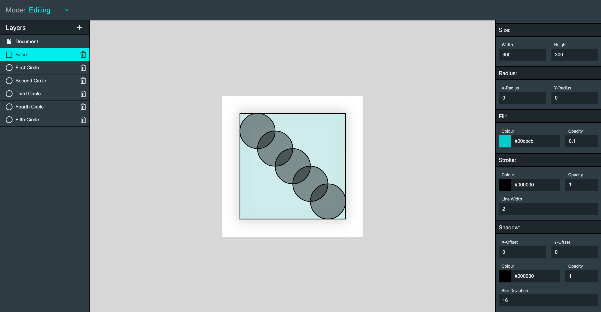

# Sveditor-UI - v0.1.0

#### This project is hosted here: [sveditor-ui.vercel.app](https://sveditor-ui.vercel.app)

Sveditor is built to allow people to easily create and use svgs within their github project README's. This repository
 houses the UI aspect of this project which allows one to visually create SVG and then subsequently provides a means to consume them - namely through the Sveditor (serverless) api.

  

## Current State of Sveditor

Sveditor, at this time, is not much more than a proof of concept. It allows a user to build SVGs out of circles and rectangles with different colours and shadows but not much more. The goal, however is to improve incrementally, I currently have the following ideas:

<table><tr><td valign="top" width="50%">
 
### Immediate Improvements 
<ul>
 <li>
  Add the ability to rotate components when editing them.
 </li>
 <li>
  Allow users to download their SVG directly from the ui.
 </li>
 <li>
  Add more basic components to customise. 
 </li>
  <li>
  Generally add more basic components to customise. 
 </li>
</ul>
</td>

<td valign="top" width="50%">

### Longer Term Goals
<ul>
 <li>
  Pull the api and the ui (this repo) together into a single monorepo.
 </li>
 <li>
  Add in some premade SVGs that can be used as a starting point.
 </li>
 <li>
  Allow users to download a config object as a means to "save their progress" and then allow them to reupload this config to continue where they took off.
 </li>
  <li>
  General improvements to UX and UI for aesthetic cohesion, ease of use and clarity.
 </li>
</ul>
</td></tr></table>
  
## Features

Though, despite there being much improvement to be done, there is some stuff that actually works in this proof of concept. Sveditor-UI has been used in its limited capacity to build the following cards:

  
  

It currently handles creating two SVG elements `<rect>` and `<circle>` aswell as the base `<svg>` tag to create a fully functioning svg. 

## Contribution

Due to the early stage of this project I am happy for any help getting this off the ground. If you are interested any help implementing new components or ways to edit existing components is greatly appreciated (Note: a change will be needed to the api too if svg generation is altered). 

If you have a change open an RFC to claim the work and make sure I haven't already picked it up. Thanks in advance.
